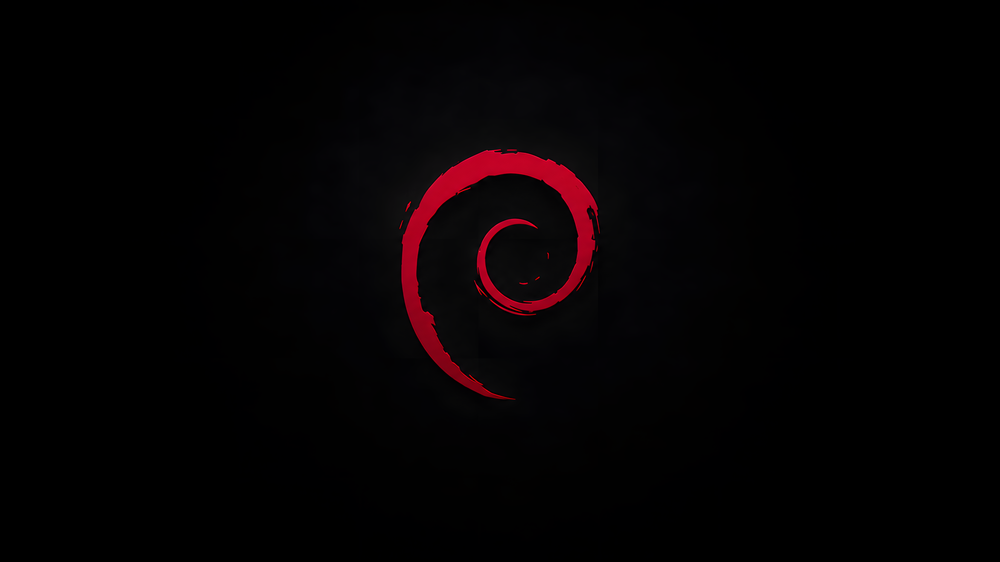

<div align="center">

# Kali Linux Wallpapers

### A curated collection of dark, cinematic, minimal and cyber-inspired wallpapers for Kali Linux.

<br>


<br><br>


</div>

---

## 🐉 About

**Kali Linux Wallpapers** is a collection of custom wallpapers inspired by
Kali Linux, cybersecurity, Linux culture, cyberpunk environments, dark
landscapes and hacker aesthetics.

The goal is simple:

> Create wallpapers that actually look good on a security researcher's desktop.

No cluttered screenshots.

No walls of fake terminal text.

No generic stock "hacker" imagery.

Just clean, atmospheric wallpapers designed around the visual identity of
Kali Linux.

---

## 🔥 Featured Wallpaper

<div align="center">

### Red Moon


**Kali Dragon × Blood Moon × Dark Japan**

</div>

A cinematic dark wallpaper combining the Kali dragon with a massive crimson
moon, Japanese-inspired landscape, torii gate and lone warrior silhouette.

Designed for dark desktop environments where icons, terminals and development
tools remain easy to see.

---

## 🎨 Wallpaper Collections

The repository will contain several different styles.

| Collection | Style |
|---|---|
| 🌑 **Dark Minimal** | Black backgrounds, subtle Kali branding |
| 🔵 **Kali Blue** | Classic blue Kali aesthetic |
| 🔴 **Red Moon** | Black and crimson cinematic environments |
| 🏔️ **Dark Landscapes** | Mountains, forests, storms and atmospheric scenes |
| 💻 **Cyber** | Matrix rain, circuitry and digital environments |
| 🌃 **Cyberpunk** | Neon cities and futuristic environments |
| 🐉 **Dragon** | Wallpapers focused entirely on the Kali dragon |
| 🌍 **World Series** | Kali-inspired designs influenced by countries and cultures |
| ⚔️ **Warrior Series** | Samurai, shinobi and dark warrior compositions |
| 🖤 **AMOLED** | Extremely dark wallpapers for minimal desktops |

---

## 🖼️ Wallpaper Gallery

<div align="center">

<table>
<tr>
<td align="center">
<br>
<b>Blue Eclipse</b>
</td>

<td align="center">
<br>
<b>Blue Flame Dragon</b>
</td>

<td align="center">
<br>
<b>Cyber Samurai</b>
</td>
</tr>

<tr>
<td align="center">
<br>
<b>Dark Cinematic</b>
</td>

<td align="center">
<br>
<b>Code Vortex</b>
</td>

<td align="center">
<br>
<b>Matrix Dragon</b>
</td>
</tr>

<tr>
<td align="center">
<br>
<b>Electric Dragon</b>
</td>

<td align="center">
<br>
<b>Cyber Core</b>
</td>

<td align="center">
<br>
<b>Midnight Mountains</b>
</td>
</tr>

<tr>
<td align="center">
<br>
<b>Volcanic Inferno</b>
</td>

<td align="center">
<br>
<b>Minimal Neon</b>
</td>

<td align="center">
<br>
<b>Matrix Terminal</b>
</td>
</tr>

<tr>
<td align="center">
<br>
<b>Misty Mountains</b>
</td>

<td align="center">
<br>
<b>Samurai × Red Moon</b>
</td>

<td align="center">
<br>
<b>Code Vortex Hacker</b>
</td>
</tr>
</table>

</div>

---

## 🌀 Debian Collection

<div align="center">

<table>
<tr>
<td align="center">
<br>
<b>Debian Minimal</b>
</td>

<td align="center">
<br>
<b>Debian View</b>
</td>

<td align="center">
<br>
<b>Debian Effects</b>
</td>
</tr>

<tr>
<td align="center">
<br>
<b>Debian Developer</b>
</td>
<td></td>
<td></td>
</tr>
</table>

</div>

---

## 🖥️ Recommended Resolution

Most wallpapers are designed primarily for:

```text
1920 × 1080
2560 × 1440
3440 × 1440
3840 × 2160
```

The primary target is **16:9 desktop displays**, with ultrawide versions added
where appropriate.

---

## ⚡ Using a Wallpaper

Clone the repository:

```bash
git clone https://github.com/a5huraya/kali-linux-wallpapers.git
cd kali-linux-wallpapers
```

Browse the collection:

```bash
find wallpapers -type f
```

Then choose your wallpaper through your desktop environment.

For XFCE:

**Desktop → Right Click → Desktop Settings → Background**

---

## 🎯 Design Philosophy

A good security wallpaper doesn't need twenty terminals and a hooded figure.

The best designs are often simpler:

**Dark. Clean. Recognizable. Atmospheric.**

The Kali dragon should remain the visual focus while the environment supports
it rather than overwhelms it.

---

## ⚠️ Trademark Notice

Kali Linux and associated trademarks belong to their respective owners.

This repository is an independent community wallpaper collection and is not
an official Kali Linux project or affiliated with Offensive Security.

Please consult the relevant trademark and branding policies before using
official marks commercially.

---

## ⭐ Support the Collection

If you enjoy the wallpapers, consider starring the repository.

It helps more Linux and cybersecurity enthusiasts discover the collection.

<div align="center">

<br>

### 🐉 Built for hackers. Made for Linux.

**KALI LINUX WALLPAPER COLLECTION**

<br>

`Hack • Learn • Build • Defend`

</div>
